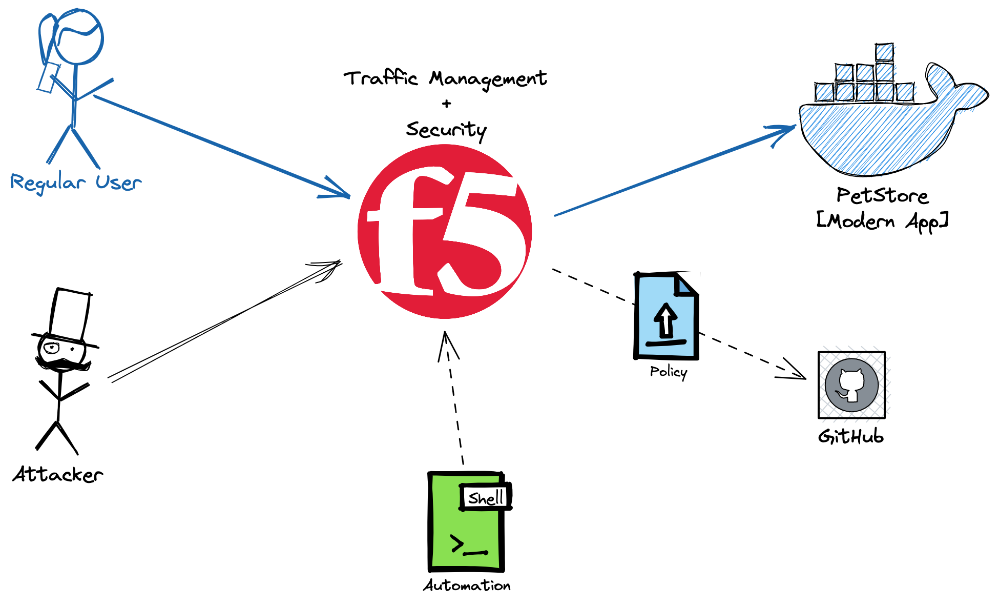

# F5 AWAF (Petstore) Demo

## Links
- DevCentral Article - [Advanced WAF v16.0 - Declarative API](https://devcentral.f5.com/s/articles/Advanced-WAF-v16-0-Declarative-API)
- [BIG-IP Declarative Security Policies](https://techdocs.f5.com/en-us/bigip-15-1-0/big-ip-declarative-security-policy.html)
- [BIG-IP Declarative WAF v16.0](https://clouddocs.f5.com/products/waf-declarative-policy/declarative_policy_v16_0_0.html)
- [UDF Lab](https://udf.f5.com/b/f7911998-b557-47b1-8228-1552aa985100)
- [NGINX App Protect](https://docs.nginx.com/nginx-app-protect/policy/)

## DEMO
> ...based on the [Swagger PetStore](https://petstore.swagger.io/#/)


### Diagram



### Steps
> You have to have AS3 RPM installed on BIG-IP to be able to use declarative API.

1. Start Petstore in *Docker*:
    ```bash
    cd docker
    docker-compose up -d
    cd
    ```
    > You may want to update `SWAGGER_URL` variable in the `./docker/docker-compose.yaml` in order to match the F5 VS.

2. Deploy app without WAF Policy:

    ```bash
    ./1_deploy_app.sh | jq
    ```

3. Do *[LTM Demo](#ltm-demo)* Part

4. Deploy app with WAF Policy:

    ```bash
    # Start Webserver for serving WAF Policy (aka SCM/Github form the Diagram)
    # Use another terminal as it runs in foreground
    ./0_start-web-server.sh
    
    
    ./2_deploy_policy.sh | jq
    # Show how AWAF Downloaded policy from Webserver
    ```

5. Do *AWAF Demo* Part

6. Delete the Deployment:
    ```bash
    ./3_delete_policy.sh | jq
    ```
> You can also use `./f5-as3.rest` to do the steps above, directly from _vscode_.

Export the SHELL `env` variable in order to connect to your BIG-IP VS:

```bash
export PETSTORE_VS=10.1.10.200
```


### LTM Demo

1. Request the whole web in the browser [https://10.1.10.200/](https://10.1.10.200)
1. Demo an Application Attack:

    ```bash
   curl -vksX GET "https://${PETSTORE_VS}/v2/user/login?username=%27%20or%201%3D1%3B--%26password%3Dtest" -H  "accept: application/json"
   ```

### AWAF Demo
> Use following steps only if you didn't use automation scripts to deploy the policy
1. Create the **API Security Policy**
1. Import the `./swagger.json` file
1. Add **Node.js**, **Unix/Linux** and **MongoDB** as the Server technologies
1. Enable **Trust XFF**
1. Disable **Signature Staging**
1. Show the [Swagger Store](https://petstore.swagger.io/#/)


1. Request the whole web [https://10.1.10.200/](https://10.1.10.20) again
1. `findByStatus` - find available pets

    ```bash
    curl -ksX GET "https://${PETSTORE_VS}/v2/pet/findByStatus?status=available" -H  "accept: application/json" | jq
    ```
1. `petId` - check the pet

    ```bash
    curl -ksX GET "https://${PETSTORE_VS}/v2/pet/7" -H  "accept: application/json" | jq
    ```

1. Place Order

    ```bash
    curl -ksX POST "https://${PETSTORE_VS}/v2/store/order" -H  "accept: application/json" -H  "Content-Type: application/json" -d "{  \"id\": 0,  \"petId\": 7,  \"quantity\": 1,  \"shipDate\": \"2020-08-18T10:10:30.747Z\",  \"status\": \"placed\",  \"complete\": true}" | jq
    ```

1. Check the Order (update the `orderId` with the output from previous example)

    ```bash
    curl -ksX GET "https://${PETSTORE_VS}/v2/store/order/14" -H  "accept: application/json" | jq
    ```

#### Attacks

1. Invalid option

    ```bash
    curl -ksX POST "https://${PETSTORE_VS}/v2/store/order" -H  "accept: application/json" -H  "Content-Type: application/json" -d "{  \"id\": 0,  \"petId\": 7,  \"quantity\": 1,  \"shipDate\": \"2020-08-18T10:10:30.747Z\",  \"status\": \"paid\",  \"complete\": true}" | jq
    ```

1. Missing parameter

    ```bash
    curl -ksX GET "https://${PETSTORE_VS}/v2/user/login?username=admin" -H  "accept: application/json" | jq
    ```

1. SQLi

    URL:
    ```bash
    "https://${PETSTORE_VS}/v2/user/login?username=' or 1=1;--&password=test"
    ```

    Encoded version:
    ```bash
    curl -ksX GET "https://${PETSTORE_VS}/v2/user/login?username=%27%20or%201%3D1%3B--%26password%3Dtest" -H  "accept: application/json" | jq
    ```

1. XSS

    ```bash
    curl -ksX GET "https://${PETSTORE_VS}/v2/user/login/<script>" -H  "accept: application/json" | jq
    ```


## Disclaimer

This demo is provided as is. Use it at your own responsibility.
